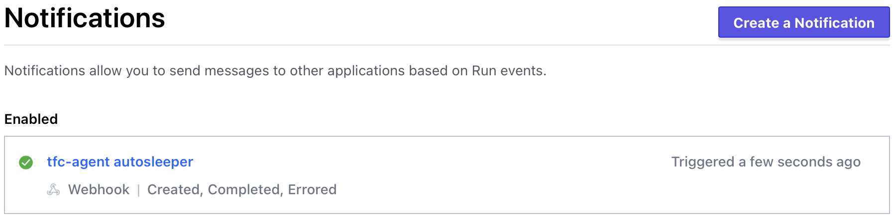

# HCP Terraform Agent in Azure Container Instances Producer Workspace

This workspace will require Azure access/credentials to provision. See [Azure Permissions](README.md#azure-permissions) section below for an important note.

## Usage

### Variables
Please provide values for the following required [variables](https://developer.hashicorp.com/terraform/language/values/variables#assigning-values-to-root-module-variables):
* `resource_group_name`: The name of an existing resource group where the containerized agent and other resources will be deployed.
* `tfc_agent_token`: The HCP Terraform Agent token you would like to use. NOTE: This is a secret and should be marked as sensitive in HCP Terraform. (See the next section for how to create this.)

In addition, I recommend that you review all other variables and configure their values according to your specifications.

### HCP Terraform Agent Token
An agent token is a secret value that is used to uniquely identify your agents and allow them to register themselves with your HCP Terraform organization. Please refer to the [documentation](https://developer.hashicorp.com/terraform/cloud-docs/agents/agent-pools) for an explanation of what an agent pool is and how to create an agent token in the HCP Terraform Settings console.

Additionally, these may now be created and managed with Terraform due to the addition of the following resources and data sources in version 0.24.0 of the [tfe provider](https://registry.terraform.io/providers/hashicorp/tfe/latest):
* [`tfe_agent_pool`](https://registry.terraform.io/providers/hashicorp/tfe/latest/docs/resources/agent_pool) resource
* [`tfe_agent_pool`](https://registry.terraform.io/providers/hashicorp/tfe/latest/docs/data-sources/agent_pool) data source
* [`tfe_agent_token`](https://registry.terraform.io/providers/hashicorp/tfe/latest/docs/resources/agent_token) resource

Prior to the addition of these resources to the tfe provider, I had written helper scripts to create and revoke agent tokens using the HCP Terraform API. Those scripts remain available [here](../../tfc-agent-ecs/producer/files/README.md).

### Other Notes
I have not exposed them as terraform variables yet but you can adjust the resource allocations for the agent task in main.tf. As of this writing, the terraform run environment built in to HCP Terraform provides 2 cores and 2GB of RAM. However, I have used the agent with as little as 256MB of RAM. YMMV

If you have an entitlement for more than one agent, this code can be updated to provide additional agents.

## Azure Permissions
In order to create a role assignment, the credentials you use to provision this workspace will require `roleAssignments/write` permission. For reference, please see this [answer](https://docs.microsoft.com/en-us/answers/questions/287573/authorization-failed-when-when-writing-a-roleassig.html). I created a custom role based on the built-in `Contributor` role with the following steps:

1. Get the role definition:
```
→ az role definition list -n "Contributor"
[
  {
    "assignableScopes": [
      "/"
    ],
    "description": "Grants full access to manage all resources, but does not allow you to assign roles in Azure RBAC, manage assignments in Azure Blueprints, or share image galleries.",
    "id": "",
    "name": "",
    "permissions": [
      {
        "actions": [
          "*"
        ],
        "dataActions": [],
        "notActions": [
          "Microsoft.Authorization/*/Delete",
          "Microsoft.Authorization/*/Write",
          "Microsoft.Authorization/elevateAccess/Action",
          "Microsoft.Blueprint/blueprintAssignments/write",
          "Microsoft.Blueprint/blueprintAssignments/delete",
          "Microsoft.Compute/galleries/share/action"
        ],
        "notDataActions": []
      }
    ],
    "roleName": "Contributor",
    "roleType": "BuiltInRole",
    "type": "Microsoft.Authorization/roleDefinitions"
  }
]
```

2. Customize and create the custom role definition as follows (enter your subscription ID in AssignableScopes):
```
az role definition create --role-definition '{
    "Name": "Custom Contributor",
    "Description": "Grants full access to manage all resources, allows you to assign or delete roles in Azure RBAC, but not manage assignments in Azure Blueprints, or share image galleries.",
    "Actions": [
          "*"
        ],
    "DataActions": [],
    "NotActions": [
        "Microsoft.Authorization/elevateAccess/Action",
        "Microsoft.Blueprint/blueprintAssignments/write",
        "Microsoft.Blueprint/blueprintAssignments/delete",
        "Microsoft.Compute/galleries/share/action"
    ],
    "NotDataActions": [],
    "AssignableScopes": ["/subscriptions/xxxxxxxxx-xxxx-xxxx-xxxx-xxxxxxxxxxxxx"]
}'
```

Verify it was created with `az role definition list -n "Custom Contributor"`.

3. Follow [these](https://registry.terraform.io/providers/hashicorp/azurerm/latest/docs/guides/service_principal_client_secret#creating-a-service-principal) steps to generate your service principal for Terraform, using the `Custom Contributor` role.

## Autosleeping tfc-agent with an Azure Function
I've included an Azure function that, when combined with [HCP Terraform notifications](https://developer.hashicorp.com/terraform/cloud-docs/workspaces/settings/notifications), enables automatically starting the agent when needed, and shutting it down when complete. If you have an entitlement for multiple agents, this function could be adapted to autoscale the number of running agents. Please refer to [this code](../../tfc-agent-ecs/producer/files/main.py) for an example implementation.



To use it, you'll need to configure a [generic notification](https://developer.hashicorp.com/terraform/cloud-docs/workspaces/settings/notifications#creating-a-notification-configuration) on each HCP Terraform workspace that you'd like to be able to automatically launch an agent. I've included a helper script that will create them for you, however you can always create and manage these in the HCP Terraform workspace Settings. You could also use the [Terraform Enterprise provider](https://registry.terraform.io/providers/hashicorp/tfe/latest/docs).

That's it! When a run is queued, HCP Terraform will send a notification to the function, booting an agent. When the run is completed, HCP Terraform will send another notification to the function, stopping the agent.

Note: The function is restricted to only accept requests coming from HCP Terraform source IP addresses only. This can be adjusted in the terraform code.

Note: [Speculative Plans](https://developer.hashicorp.com/terraform/cloud-docs/run/remote-operations#speculative-plans) do not trigger this autoscaling.

Note: The agent will remain running as long as a run is in the Needs Confirmation state. An alternative approach could be taken to avoid this limitation.

### How to modify the function
I prepared the zip file for deployment as follows (from within the function-app folder):
```
pip3 install --target .python_packages/lib/site-packages -r requirements.txt
zip -r ../function-app.zip .
```

If you'd like to modify the function after you've provisioned with Terraform, you can develop against it using the [VS Code Azure Function Extension](https://docs.microsoft.com/en-us/azure/azure-functions/functions-develop-vs-code?tabs=python).

### Add Notification to Workspaces script

`../../tfc-agent-ecs/producer/files/add_notification_to_workspaces.sh` will add the notification configuration to one or more workspaces in the organization specified. You must provide:
1. a HCP Terraform organization or admin user token as the environment variable `TOKEN`.
2. the notification token you've configured (Terraform variable `notification_token`) as the environment variable `HMAC_SALT`.
3. the workspace(s) to which you'd like to add the notification configuration.
4. the webhook URL output from Terraform.

Example usage:
```
→ ../../tfc-agent-ecs/producer/files/add_notification_to_workspaces.sh hashidemos andys-lab https://tfc-agent-webhook-7394fab8.azurewebsites.net/api/webhook
```

Here's an example usage with the [TFE provider](https://registry.terraform.io/providers/hashicorp/tfe/latest/docs):
```
resource "tfe_notification_configuration" "agent_webhook" {
 name                      = "tfc-agent"
 enabled                   = true
 destination_type          = "generic"
 triggers                  = ["run:created", "run:completed", "run:errored"]
 url                       = data.terraform_remote_state.tfc-agent-azure-producer.outputs.webhook_url
 workspace_external_id     = tfe_workspace.test.id
}
```

## References
* [HCP Terraform Agents](https://developer.hashicorp.com/terraform/cloud-docs/agents)
* [Agent Pools and Agents API](https://developer.hashicorp.com/terraform/cloud-docs/api-docs/agents)
* [Agent Tokens API](https://developer.hashicorp.com/terraform/cloud-docs/api-docs/agent-tokens)
